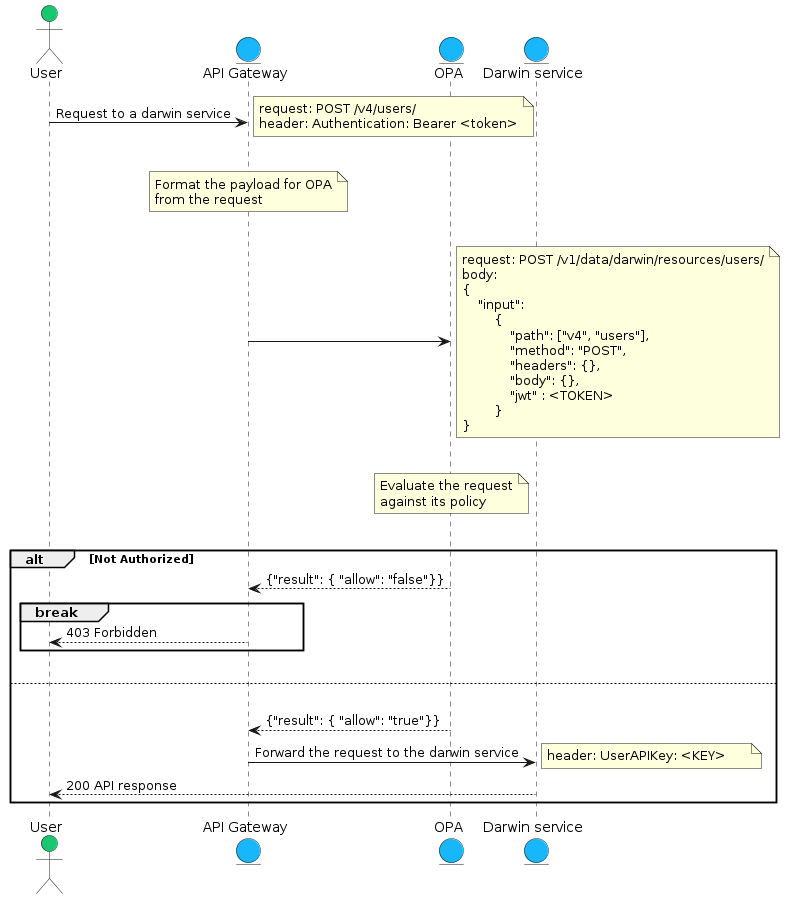
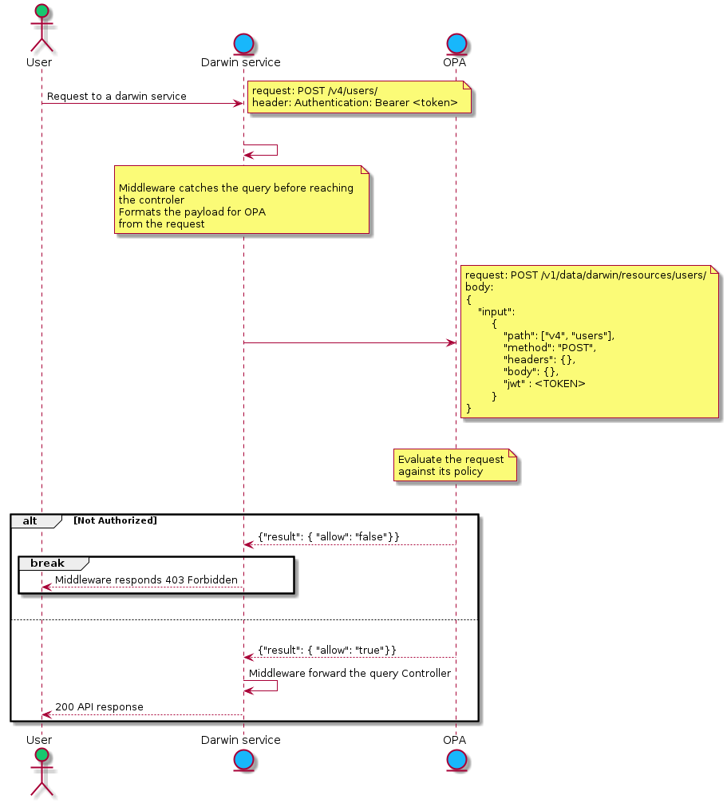

# Darwin OPA project

The objective of this project is to implement a centralize Policy Decision System for Darwin based on Open Policy Agent

[Open Policy Agent](https://www.openpolicyagent.org/)

## Running it on your machine
You'll need :  
- A linux environment with docker, wsl is necessary on windows
- The docker compose plugin
  
To run everything (against nonprod - This method will start to fail because we don't have the Authorization-API-Key secret)
```sh
    $ git clone git@github.com:wiley/phoenix-opa
    $ cd phoenix-opa
    $ docker-compose up --build
```
Or you can run it in VS Code + Container + WLS-IP-LocalEnv (preferred method)
```sh
    $ docker rm opa-service
    $ cd dev
    $ docker-compose up --build
```
For the Container + WLS-IP-LocalEnv environment,  if you make changes to the policies in the /policies folder they will be picked up dynamically by the dev/docker-compose instance.  (Look at the Container after file changes to see if there is an OPA compile error like {"duration":25129458,"err":"1 error occurred: ...)


## Dev Container and LocalEnv

Since OPA is an application it doesn't necessarily make sense to run in a .DevContainer under VS Code because you won't be able to see anything its doing.
But you can run the dev/docker-compose.yml file which is setup to patch into the LocalEnv as "opa-service" on port 51118

```sh
    $ docker rm opa-service
    $ cd dev
    $ docker-compose up --build
```

The container should pickup changes made to .rego files in the /policies folder because of the --watch parameter.

## Containers and Policies

For the first iteration we will package all of the policies into one bundle and copy it inside the official container. That way we simplify the delivery, as deploying the rules will be just deploying a service in k8s as a pod.

## Steps of implementation

We have 3 steps to start implementing opa in darwin; what is important to note here is independently of where we put the check on the policies, we can _write them once_ and apply them at any of those levels.


### First step : check at the api gateway level
(Python code may/may not be using this method.)
We want to be able to call the decision endpoint directly from an api gateway, following this model.



### Second step : check from a middleware inside each service
(C# V4 routes are connecting this way through the Darwin-AuthorizationMiddleware probject)
In our second objective we would like to implement a middleware for all of services to talk to OPA directly. With that step clients can call the backend services directly without going through the API gateway and still enforcing the policies.



### Third step : integrate it in istio/envoy
(This is not implemented yet - but policy_darwin_authz.rego is converting envoy input to dinput for future handling)
In the third iteration we would delegate the query to OPA to the orchestration layer using Istio and Envoy-OPA. 
(we need an istio diagram here too although it's very similar to what happens in the api gateway).
The best part here is that the service will never know when a query is rejected.

[Envoy](https://istio.io/latest/docs/ops/deployment/architecture/#envoy)

[Envoy-OPA](https://www.openpolicyagent.org/docs/latest/envoy-introduction/#what-is-opa-envoy-plugin)

## Serialization of the query
In order for OPA to process the policies we need to standardize the way the request is serialized and sent to OPA. 
we would like to format the query as simply as possible 
```json
{   
    "input":
        {
            "path": ["v4", "users"],
            "method": "POST",
            "body": "{here comes the body of the request, sometimes it's needed to make a decision}",
            "jwt" : "<TOKEN>",
            "query": "{query string parameters ?param=value&param2=value2 -> 'param': 'value', 'param2':'value2'}",
            "headers": "{ \"x-api-key\": \"aaaaaaa\", \"x-user-id\": \"70014115\" }",
        }
}
```

## Endpoints for the query

To get a nice organization of the policies, we would like to split them in packages per resources. By default OPA will put all the packages in /v1/data, so we propose to add a darwin/resources/{resourcename} suffix for policy resolution.
So let's say we want to check if a user can post to /v4/users, we need to call OPA that way
```sh
curl -XPOST https://opa-nonprod.dev.sgp.wiley.host/v1/data/darwin/resources/users/ --data "{
      "input":
        {
            "path": ["v4", "users"],
            "method": "POST",
            "body": "{..}",
            "jwt" : "<TOKEN>",
            "query": "{\"param1\":\"value1\",\"param2\": \"value2\"}",
            "headers": "{\"x-api-key\":\"aaaaa\", \"x-user-id\": \"70014115\"}",
        }
}" --header "Content-type: application/json"
```
and the response will often be in the form of a json object containing "result":
```json
{"result": {"allow": true|false}}
```

### Debugging
If you add "?explain=notes&pretty=true" to the call to OPA then it will show you all of your trace messages from any path that completed.  (If you add ?explain=full then you get all paths even if they only ran partially.)  A developer can add these trace messages like trace("Route GET /accounts") to the code and leave them there and they will not interfere with the regular calls because "explanation" wouldn't show up without that query string.

```json
{
    "explanation": [
        "query:1                                               Enter data.darwin.resources.accounts = _",
        "policies/policy_darwin_resources_accounts.rego:25     | Enter data.darwin.resources.accounts.allow",
        "policies/policy_darwin_resources_accounts.rego:29     | | Note \"GET /accounts/{12345}\"",
        "policies/policy_darwin_resources_accounts.rego:31     | | Note \"User ID: 1803721\""
    ],
    "result": {
        "allow": true
    }
}
```

## Implementation choices

### Data fetching
the data necessary to make a decision around users can be massive : account roles, organization roles, group roles, product entitlement etc. So for our firt implementation we decided to use a pull model and have OPA fetching the data sychronistically from each of the services responsible for those data (company-api, groups-api, entitlements-api, etc.).

Once we have the model in place we will implement a specialize authzdata-service that will manage an "eventually consistent" cache of the data necessary to make decisions so that we can lower the decision time.

### Abstraction of the input

Today there is no real standard of how to serialize the request to send to opa so we've implemented an abstraction of the input called darwin.authz.dinput. It'll help us in the future once me move to Envoy to be able to just transform an Envoy-OPA formatted query to a darwin one.  (Do not write functions that directly check "input.something" because the payload is completely different when called from Envoy than regular API calls.)

```rego
    import darwin.authz.dinput
```
Our dinput object has since been modified to include common information that every policy will require:
```json
{
  "path": ["v4", "accounts"],
  "method": "GET",
  "jwt": "eyJhbxxxxxxxxxxxxxxxxxxxxx...",
  "headers": { "header1":value, "header2":value },
  "query": { "include":"data", "other":"value" },
  "body": { raw payload },
  "parsedJwt": { ..., "user_id": 123, ... },
  "userId": 123,
  "hasApiKey": false,
  "authorizationCache": { organizationRoles:[], ... }
}
```

### Policies functions and helpers
When writing policies, we want to store the helpers and function in the darwin.{package}. 
The darwin.resources.{resources} is dedicated for top level resources policies in our API.
ex:
```rego
    package darwin.resources.learning-objects

    import darwin.authz.dinput
```
